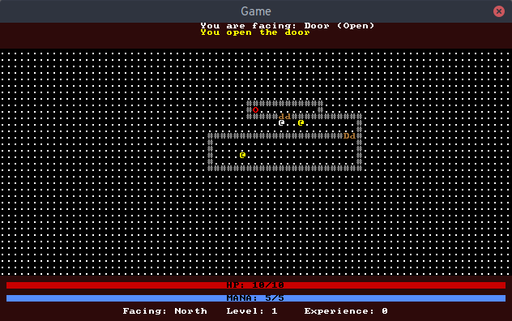

# Installation #
## Dependencies ##
- Python 3.3+
- [tdl](https://pypi.python.org/pypi/tdl) v. 3.0+

If all the dependencies are installed correctly, the game should run by executing the 'play' file in the root of the directory.

`./play`

# Images #
